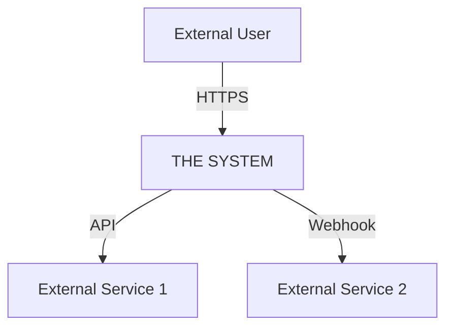
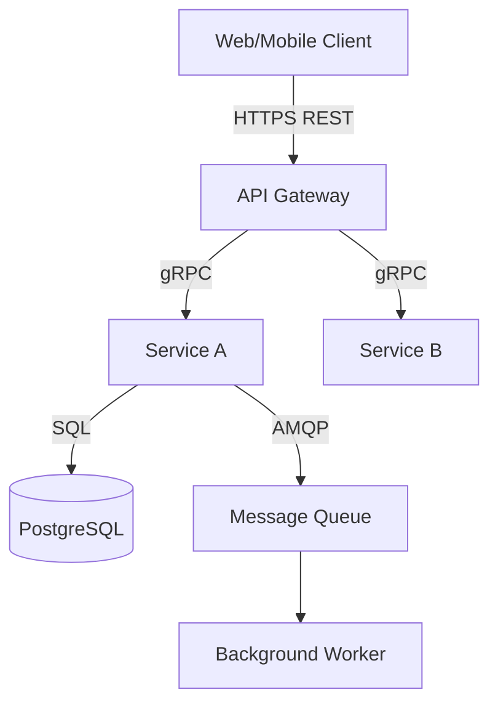

# High-Level Design: [SYSTEM/SERVICE NAME]
Version: 1.0 | Date: [YYYY-MM-DD]
Author: VAMFI Solution Architect | Status: Draft

---

## 1. Overview

[2-3 paragraphs describing the system's purpose, the business context, and the key architectural decisions that shape this design.]

---

## 2. Architectural Drivers

### Quality Attributes
| Attribute | Requirement | Rationale |
|---|---|---|
| Performance | [e.g., p95 API latency < 200ms] | [business reason] |
| Availability | [e.g., 99.9% uptime SLO] | [business reason] |
| Scalability | [e.g., 100k concurrent users] | [business reason] |
| Security | [e.g., SOC 2 Type II compliance] | [business reason] |

### Constraints
- [TECHNICAL CONSTRAINT]
- [REGULATORY CONSTRAINT]
- [TEAM/SKILL CONSTRAINT]

---

## 3. System Context (C4 Level 1)

**External Actors:**
| Actor | Description | Interaction |
|---|---|---|
| [External User] | [Who they are] | [How they interact] |
| [External System] | [What it does] | [Protocol/data exchanged] |

---

## 4. Container Diagram (C4 Level 2)

**Containers:**
| Container | Technology | Purpose |
|---|---|---|
| [API Gateway] | [Node.js / nginx] | [Request routing, auth] |
| [Service A] | [TECHNOLOGY] | [PURPOSE] |
| [Database] | [PostgreSQL] | [Persistent storage] |
| [Queue] | [RabbitMQ / SQS] | [Async messaging] |

---

## 5. Technology Stack

| Layer | Technology | Rationale |
|---|---|---|
| Frontend | [TECH] | [WHY] |
| Backend API | [TECH] | [WHY] |
| Database (primary) | [TECH] | [WHY] |
| Cache | [TECH] | [WHY] |
| Message queue | [TECH] | [WHY] |
| Infrastructure | [TECH] | [WHY] |
| CI/CD | [TECH] | [WHY] |
| Observability | [TECH] | [WHY] |

---

## 6. Security Architecture

[Describe the security model at the architecture level:]
- Authentication approach: [e.g., JWT with refresh tokens via OAuth 2.0]
- Authorisation model: [e.g., RBAC with 3 roles: admin, user, viewer]
- Data classification: [e.g., PII encrypted at rest with AES-256]
- Network security: [e.g., VPC isolation, WAF in front of API]
- Secrets management: [e.g., AWS Secrets Manager, rotated every 90 days]

---

## 7. Architecture Decision Records

### ADR-001: [DECISION TITLE]
**Status**: Accepted
**Context**: [Why this decision was needed]
**Decision**: [What was decided]
**Consequences**: [Positive and negative outcomes]
**Alternatives**: [What was rejected and why]

---

### ADR-002: [DECISION TITLE]
**Status**: Accepted
**Context**:
**Decision**:
**Consequences**:
**Alternatives**:

---

## 8. Migration Strategy

[Describe how the current state will migrate to this target architecture:]
- Approach: [Strangler fig / Phased decomposition / Big bang — justify]
- Phase 1: [What moves first and why]
- Phase 2: [What moves next]
- Risk: [What could go wrong and the mitigation]

---

## 9. Open Questions

| # | Question | Impact | Owner | Due |
|---|---|---|---|---|
| 1 | [QUESTION] | [HIGH/MED/LOW] | [ROLE] | [DATE] |
