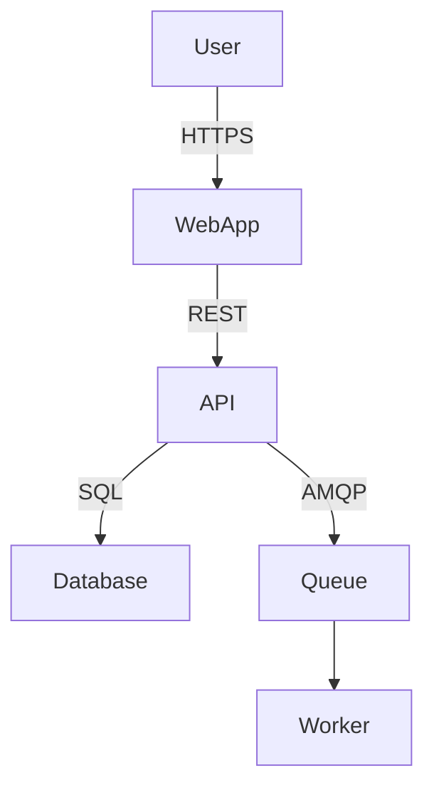

# Target Architecture Design

Design a pragmatic, scalable, and secure target architecture grounded in the current state assessment and business requirements. Produce a High-Level Design (HLD) with Architecture Decision Records (ADRs) for every significant choice.

## Overview

Good architecture is the minimum structural decisions needed to achieve the required quality attributes. This skill produces a target HLD that is specific enough to guide implementation but flexible enough to adapt as understanding deepens.

## Architecture Design Process

### Step 1: Define Architectural Drivers

Before designing, clarify the forces shaping the architecture:
- **Functional requirements**: the most architecturally significant features
- **Quality attributes**: performance, scalability, security, availability targets
- **Constraints**: technology mandates, regulatory requirements, budget, team skills
- **Migration constraints**: what must stay, what can change, what must be preserved

### Step 2: Select Architectural Pattern

Based on drivers and constraints, select the target pattern:
- Determine scale requirements (single team vs. multi-team, low vs. high traffic)
- Match pattern to team size and maturity (microservices require operational maturity)
- Consider migration path from current state (big-bang vs. strangler fig vs. phased)

Document the decision in an ADR.

### Step 3: Design the System Structure (C4 Model)

**Context (Level 1)**: The system and its external actors and systems.

**Containers (Level 2)**: The major deployable units (web app, API, worker, database, queue).

**Components (Level 3, for critical containers)**: The key internal building blocks.

Describe each diagram in text using Mermaid syntax where helpful:



### Step 4: Technology Stack Decisions

For each layer, select technology and produce an ADR:

| Layer | Technology | Rationale | Alternatives Considered |
|---|---|---|---|
| Frontend | [tech] | [why] | [what else was evaluated] |
| Backend API | [tech] | [why] | [...] |
| Database | [tech] | [why] | [...] |
| Cache | [tech] | [why] | [...] |
| Queue/Event | [tech] | [why] | [...] |
| Infrastructure | [tech] | [why] | [...] |

### Step 5: Architecture Decision Records (ADRs)

For every significant decision, produce an ADR:

```markdown
# ADR-[N]: [Short Decision Title]

**Status**: Proposed | Accepted | Deprecated

**Context**: [What forces led to this decision? What constraints apply?]

**Decision**: [What was decided?]

**Consequences**:
- Positive: [benefits of this choice]
- Negative: [trade-offs accepted]

**Alternatives Considered**:
- [Option A]: [why rejected]
- [Option B]: [why rejected]
```

### Step 6: Migration Strategy

Describe the path from current to target state:
- **Strangler fig**: new capability built alongside old, traffic gradually migrated
- **Branch by abstraction**: abstract interfaces introduced, then implementation swapped
- **Big bang**: complete rewrite and cutover (justify if recommending this)
- **Phased decomposition**: extract services one at a time starting with the highest value

## Output Format

Produce:
1. HLD document with context, container, and component diagrams (Mermaid)
2. Technology stack table with rationale
3. One ADR per major decision
4. Migration strategy section

## Additional Resources

- **`references/architectural-patterns.md`** — Pattern catalogue with trade-offs
- **`references/adr-library.md`** — Example ADRs for common decisions
- **`assets/hld-template.md`** — Blank HLD template
